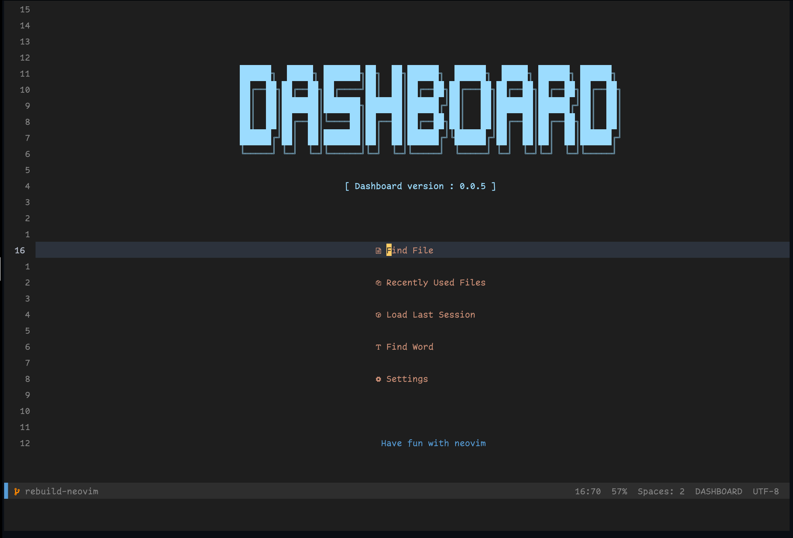
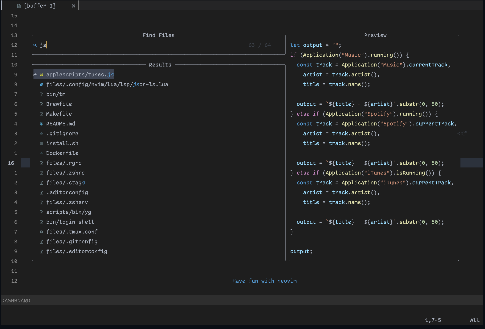

This is a place for me to store my configuration so that when I get a new machine or re-install one, I can set my computer back up as fast as possible.




## before you start

Make sure, that before you start that you install the following apps that are required for everything to work.

<details>
  <summary>Mac</summary>

- Xcode Command Line Tools
- Git

Xcode will give your mac all the tools you will need to run the scripts.

</details>

## running the install script

```bash
> git clone https://github.com/jrock2004/dotfiles.git ~/.dotfiles
> cd ~/.dotfiles

# If you want to see options, run the following:
> ./install.sh

# To run the default setup
> ./install.sh all
```

## after script has ran

So if the script runs through and you receive no errors, open a new terminal window and we will install some things that the installer could not do.

I use [Volta](https://volta.sh) at this time to manage my node versions and node dependencies. Lets start off by install LTS version of Node

```bash
> volta install node@lts
```

Now lets install some global node plugins globally that I use that are not required for my dotfiles.

```bash
> volta install yarn ember-cli prettier
```

## setting up lua language server

To get the most update to date docs, [visit lua lang server wiki](<https://github.com/sumneko/lua-language-server/wiki/Build-and-Run-(Standalone)>)

Run the following commands

```bash
> git clone https://github.com/sumneko/lua-language-server ~/
> cd lua-language-server
> git submodule update --init --recursive
> cd 3rd\luamake
```

<details>
  <summary>Mac</summary>

```bash
> ninja -f ninja/macos.ninja
> cd ../..
> ./3rd/luamake/luamake rebuild
```

</details>

Now lets setup so our lua formatter works

```bash
> luarocks install --server=https://luarocks.org/dev luaformatter
```

## open up neovim

We are now ready to run neovim. There are going to be a few things we need to do after we open it. You might get some errors. This is ok and expected. Now run the following in vim:

```bash
:LspInstall bash
:LspInstall css
:LspInstall dockerfile
:LspInstall efm
:LspInstall html
:LspInstall json
:LspInstall lua
:LspInstall typescript
:LspInstall vim
:LspInstall yaml
```

## settings for iTerm2

If you are on a mac you will want to use iTerm2 for your terminal. Here are the settings I have configured for it

```yml
General:
  Closing:
    Confirm Quit: Un-checked
  Selection:
    Access Clipboard: Check
Appearance:
  General:
    Theme: Minimal
Profiles:
  Colors:
    Color Presets: Ayu Dark
  Text:
    Enable subpixel: Check
    Font: Dank Mono
    Font Weight: Regular
    Font Size: 22
    Letter Space: 100
    Line Space: 130
    Use ligatures
    Use different font: Check
    Non-ASCII Font: FiraCode Nerd Font Mono
    Non-ASCII Weight: Regular
    Non-ASCII Size: 22
    Non-ASCII Ligatures: Check
```

## vscode

I do not use it as much but I still configure it for when I have to use it. It can be [found on gist](https://gist.github.com/jrock2004/34c134d3a4a8bfb84336fd5d52472237)

## inspiration

My inspiration of my dotfiles comes from [Nick Nisi](https://github.com/nicknisi/dotfiles).
The next person who got me into converting my neovim setup to Lua is [Chris@Machine](https://www.chrisatmachine.com/neovim). Thank you for showing me the way. 
