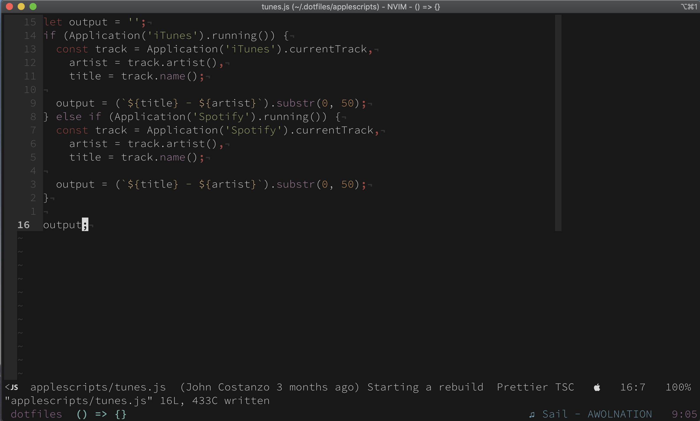

# My Dotfiles
This is the configuration that I use on all my machines. These will work for [Mac](https://apple.com), [Linux](https://linux.org), and or [WSL](https://docs.microsoft.com/en-us/windows/wsl/about). 



## Before Installing
Before starting you will want to install the following applications:

- curl
- git
- wget

## Installation
To install the dotfiles, you will want to [clone my install repo](https://github.com/jrock2004/install-scripts.git) which will clone this repo for you.

## After Install
After the install you will want to set your base16 theme. You can do this by running the following command in your terminal

``` bash
> base16_default-dark
```
*Note:* You can set your theme to anything you want

## Thanks
I did not build this from scratch. I had help and started with a template. Thanks [Nick Nisi](https://github.com/nicknisi)
