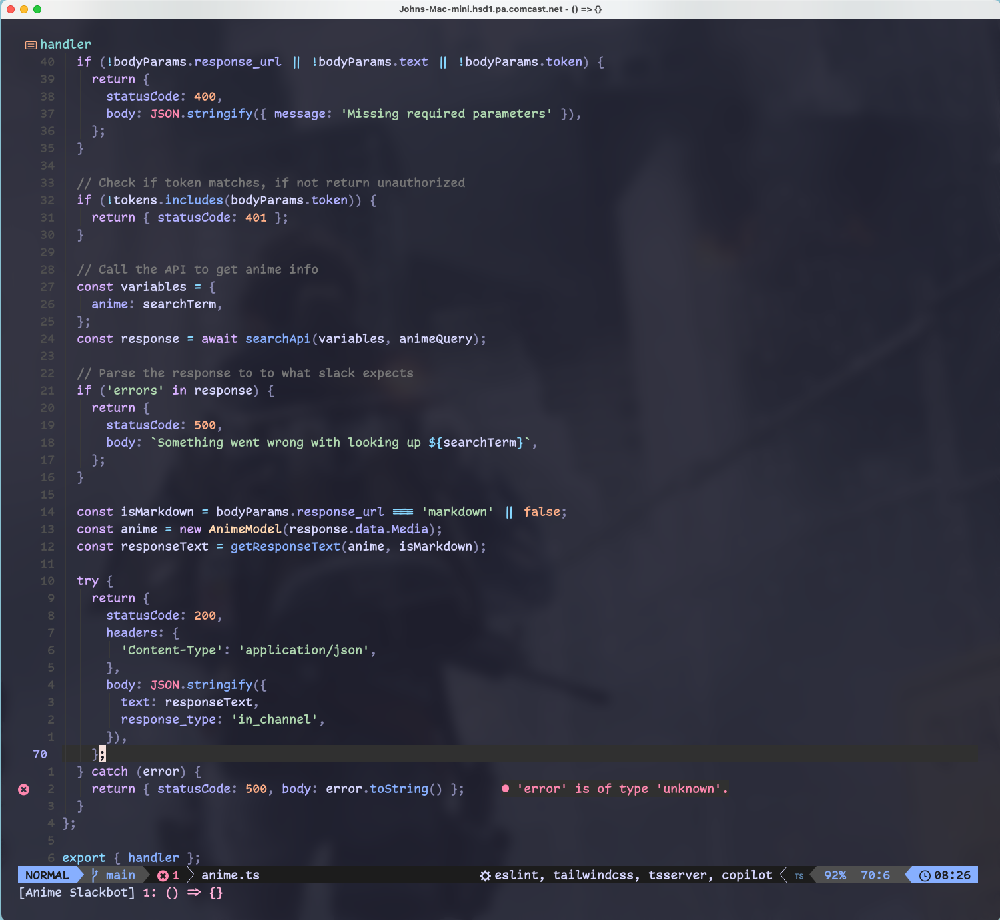

<p align="center">
  
</p>

<p align="center">
  <b>:sparkles: John's Dotfiles :sparkles:</b>
</p>

<br />

# Thanks for dropping by!

This repository contains my personal dotfiles, which are configuration files and scripts that customize various aspects of my system. By keeping my dotfiles under version control, I can easily synchronize them across multiple machines and ensure consistency in my development environment.

<p align="center">
  
</p>

# Tested OS

- Arch Linux
- Mac OSX
- Ubuntu

# Installation

Clone this repository to your home directory:

```bash
git clone https://github.com/jrock2004/dotfiles.git ~/.dotfiles
```

Change into the directory

```bash
cd ~/.dotfiles
```

Run the install script to set up your machine

```bash
./install.sh
```

# Organization

The dotfiles in this repository are organized into logical categories, making it easier to locate and modify specific configurations. Here's a brief overview of the main directories:

- `applescripts/`: AppleScripts for automating tasks on macOS
- `bin/`: Executable scripts that are added to the `$PATH`
- `files`: Files that are symlinked to `$HOME`
- `zsh`: Additional Zsh configuration files

# Maintenance

To keep your dotfiles up to date, it is recommended to periodically pull the latest changes from this repository. You can do this by running the following command from the dotfiles directory:

```bash
git pull
```

# Customize and Extend

Feel free to modify and customize these dotfiles to suit your needs. Add your own configurations, aliases, and functions, or remove those that you don't find useful. Don't forget to keep your modifications under version control to track your changes.

If you come across useful improvements or additions that you think would benefit others, please consider contributing them back to the repository through pull requests. Sharing your knowledge and enhancements with the community is highly appreciated.

# Acknowledgements

I would like to acknowledge the open-source community and the countless developers who have shared their dotfiles, tips, and tricks. Your contributions have been invaluable in shaping and improving my own setup.

- [Nick Nisi](https://github.com/nicknisi/dotfiles)
- [Christian Chiarulli](https://www.chrisatmachine.com/)
- [Dorian Karter](https://github.com/dkarter/dotfiles)
